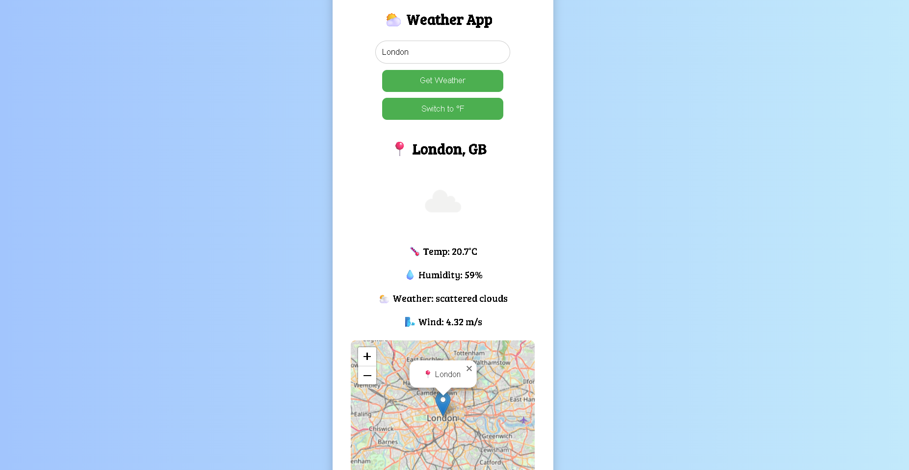

# ⛅ Weather App

A simple, responsive weather app that shows real-time weather conditions using the OpenWeatherMap API.  
Built using **HTML**, **CSS**, and **JavaScript** with additional support for map display using **Leaflet.js**.

---

## 🔥 Features

- 🔍 Search weather by city name
- 🌡️ Toggle temperature between Celsius (°C) and Fahrenheit (°F)
- 🧭 Displays:
  - Temperature
  - Weather condition
  - Humidity
  - Wind speed
- 🗺️ Shows location on an interactive map using Leaflet and OpenStreetMap
- ⌨️ Supports `Enter` key to search
- 📱 Fully responsive design for mobile and desktop

---

## 📸 Demo Screenshot

 <!-- Add your actual screenshot file if available -->

---

## 🚀 Live Demo

[Click here to see it live](https://your-deployed-site-link.com)  
*(Replace this link with your actual GitHub Pages or deployment URL)*
http://127.0.0.1:5501/Weather-app/index.html
---

## ⚙️ Tech Stack

- HTML5
- CSS3
- JavaScript (ES6)
- [OpenWeatherMap API](https://openweathermap.org/)
- [Leaflet.js](https://leafletjs.com/) + OpenStreetMap

